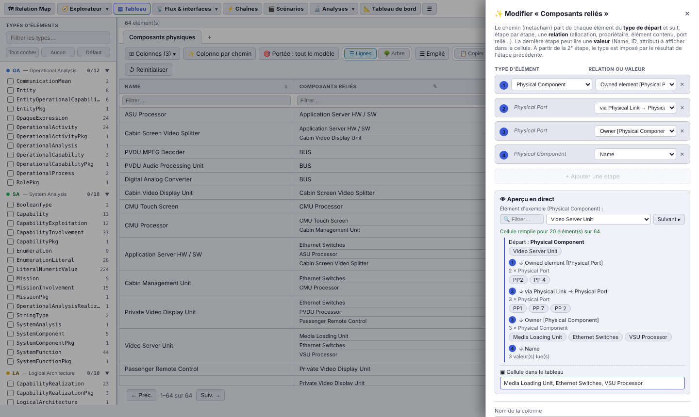

# 🔷 Arcalyse

### *Your Capella model, inside and out.* · *Votre modèle Capella, sous toutes ses coutures.*

**Explore, check and understand a Capella / ARCADIA model — in a single HTML file.**

No installation · no server · works offline

**[English](#english)** · **[Français](#français)**

---

# English

## Why Arcalyse?

A Capella model grows fast: hundreds of functions, exchanges, components and ports, spread over five layers. In the workbench, each diagram only shows a piece of it. **Arcalyse reads the `.capella` file directly** and gives you, in a few seconds, an overview, Capella-style views and consistency checks — without opening Capella, without installing anything.

- 📂 **Drag and drop** your `.capella` file: the model is analysed in the browser, on your computer.
- 🔌 **Offline**: a single standalone HTML file (D3 library embedded), usable without a connection.
- 🧭 **All ARCADIA layers**: OA, SA, LA, PA, EPBS — functions, components, exchanges, chains, scenarios, requirements, properties.
- 🩺 **Ready-to-use checks**: unallocated elements, unconnected ports, incomplete traceability, names to review…
- 📤 **Exports everywhere**: CSV, PNG, SVG, PDF, standalone HTML reports, dashboards printable in A4.
- 🔄 **File watch**: Arcalyse detects new versions of the `.capella` file and shows what changed.

## What you can do

### 🗺 Navigate the model relations
The **Relation Map** graph centres the view on an element and expands its neighbours down to the chosen depth: breakdowns, allocations, exchanges, cross-layer realizations. Horizontal, vertical or radial layouts; zoom, filters by relation and type; image export.

### ✨ Compute columns along relation paths
In the **▤ Table**, a **path column** follows, for each row, a sequence of model relations and shows what it finds at the end: the functions realized by each component, the components connected through their ports and physical links, the package owning a requirement… You choose the start type then, step by step, the relation to follow (allocation, realization, owner, contained element, reference, going through an intermediate element) and finally the value to display. A **live preview** shows, on a sample element, the path followed and the cell content, as well as the number of rows that will be filled. Columns can be sorted, filtered, copied to Excel and exported to CSV; they are saved with the view.

### ⚡ Read functional chains
Each functional chain, operational process or physical path is redrawn, with its inputs / outputs, the involved functions, their allocation and the exchanges. Filters by type, layer and content; PDF, PNG, SVG, ZIP or HTML export of all chains at once.

### ƒ⇆ See the exchanges as in Capella
The **Blocks views** follow the Capella rendering: green (system) or blue (actor) functions, input and output pins, exchanges and remote function. A click on the remote function takes you there. Same principle for **Operational Analysis**, **System / Logical Components**, **Behavior Exchange** and **Physical Links**, each with a row view, an N² matrix and checks.

### 🎬 Review scenarios
Sequence diagrams (ES, FS, OES, OAS, IS) are redrawn: lifelines, messages, executions, states and modes, combined fragments (ALT, LOOP…), references. Checks and PNG / SVG export.

### 🔬 Analyse and check
- **ƒ Functions**: hierarchy with descriptions, Excel-style table (value filters, copy), allocation to the system or to actors, cross-layer traceability, metrics, **name quality** (action verbs in French and English, customisable rules) and printable **functional file**.
- **🧬 Cross-layer traceability**: OA → SA → LA → PA → EPBS realization rates by category, at a glance, and the list of untraced elements.
- **🎯 Capabilities & missions**, **🔁 Modes & states**, **📑 Requirements**, **🏷 Properties**, **🗃 Data & interfaces**, **⛓ Constraints**.
- **⚖ Version comparison**: elements added, deleted, modified or moved between two versions of the model, with an exportable report.

### 📐 Build your dashboards
Choose among dozens of indicators (number of elements, function allocation, description rate, empty chains, traceability…), arrange them on A4 pages, print or export to HTML.

### And also
- 🧭 **Explorer**: tree, cards by layer, ARCADIA type index.
- 🔗 **Links**: all the model relations, filterable and exportable.
- ▤ **Table**: all elements in a table, with view tabs, relation columns and computed path columns (live preview), sort, filters and CSV export.
- 🎨 **Themes**: Dark, Light, Office 2007, high contrast, and your own custom theme.
- 🎓 **Guided tour** and built-in help, for each view.
- 💾 **HTML page**: save the application with your model, your dashboards and your settings, in a single file to share.

## Getting started

1. **Get the HTML file**:
   - English version, built from the sources: `node build.js --lang en` produces **`dist/arcalyse-en.html`** (interface, help and exports in English);
   - French version: delivered, ready to use, in **[`livraison/arcalyse-fr.html`](livraison/)** (“Download raw file” button on GitHub), or built with `node build.js` → **`dist/arcalyse-fr.html`**.
2. **Open it** in a recent browser (tested with Google Chrome version 155), even without a network.
3. **Drag and drop** your `.capella` file (or click 📂 Browse…). That's it.

> To try it without a model of your own: the public samples [In-Flight Entertainment System](https://github.com/dbinfrago/Capella-IFE-sample) and [AIDA](https://sahara.irt-saintexupery.com/AIDA/AIDAArchitecture) are in `tests/models/` (under their own licences, EPL 2.0 and CC BY-SA 4.0: see [`tests/models/LISEZMOI.md`](tests/models/LISEZMOI.md)).

## Licence

Arcalyse is free software, distributed under the **GNU General Public License version 3** — see [`LICENSE`](LICENSE) and [`NOTICE.md`](NOTICE.md).
Copyright © 2026 Romain Lescole. Provided without any warranty.

Capella and ARCADIA are trademarks of their respective owners (Eclipse Foundation, Thales). Arcalyse is an independent tool, compatible with Capella models: neither official nor affiliated.

D3.js v7.9.0 is embedded under the ISC licence (© 2010-2023 Mike Bostock).

---

# Français

## Pourquoi Arcalyse ?

Un modèle Capella grossit vite : des centaines de fonctions, d'échanges, de composants, de ports, réparties sur cinq couches. Dans l'atelier, chaque diagramme n'en montre qu'un morceau. **Arcalyse lit directement le fichier `.capella`** et vous donne, en quelques secondes, une vue d'ensemble, des vues façon Capella et des contrôles de cohérence — sans ouvrir Capella, sans rien installer.

- 📂 **Glissez-déposez** votre `.capella` : le modèle est analysé dans le navigateur, sur votre poste.
- 🔌 **Hors ligne** : un seul fichier HTML autonome (bibliothèque D3 embarquée), utilisable sans connexion.
- 🧭 **Toutes les couches ARCADIA** : OA, SA, LA, PA, EPBS — fonctions, composants, échanges, chaînes, scénarios, exigences, propriétés.
- 🩺 **Des contrôles prêts à l'emploi** : éléments non alloués, ports non connectés, traçabilité incomplète, noms à revoir…
- 📤 **Exports partout** : CSV, PNG, SVG, PDF, rapports HTML autonomes, tableaux de bord imprimables en A4.
- 🔄 **Suivi du fichier** : Arcalyse détecte les nouvelles versions du `.capella` et montre ce qui a changé.

## Ce que vous pouvez faire

### 🗺 Naviguer dans les relations du modèle
Le graphe **Relation Map** centre la vue sur un élément et déplie ses voisins jusqu'à la profondeur voulue : décompositions, allocations, échanges, réalisations entre couches. Dispositions horizontale, verticale, radiale ; zoom, filtres par relation et par type ; export image.

### ✨ Calculer des colonnes par chemin de relations
Dans le **▤ Tableau**, une **colonne par chemin** suit, pour chaque ligne, une suite de relations du modèle et affiche ce qu'elle trouve au bout : les fonctions réalisées par chaque composant, les composants reliés par leurs ports et liens physiques, le paquetage propriétaire d'une exigence… On choisit le type de départ puis, étape par étape, la relation à suivre (allocation, réalisation, propriétaire, élément contenu, référence, passage par un élément intermédiaire) et enfin la valeur à afficher. Un **aperçu en direct** montre, sur un élément d'exemple, le chemin parcouru et le contenu de la cellule, ainsi que le nombre de lignes qui seront remplies. Les colonnes se trient, se filtrent, se copient vers Excel et s'exportent en CSV ; elles sont enregistrées avec la vue.

### ⚡ Lire les chaînes fonctionnelles
Chaque chaîne fonctionnelle, processus opérationnel ou chemin physique est redessiné, avec ses entrées / sorties, les fonctions impliquées, leur allocation et les échanges. Filtres par type, couche et contenu ; export PDF, PNG, SVG, ZIP ou HTML de toutes les chaînes d'un coup.

### ƒ⇆ Voir les échanges comme dans Capella
Les **Vues Blocs** reprennent le rendu de Capella : fonctions vertes (système) ou bleues (acteurs), pins d'entrée et de sortie, échanges et fonction distante. Un clic sur la fonction distante vous y emmène. Même principe pour l'**Operational Analysis**, les **System / Logical Components**, le **Behavior Exchange** et les **Physical Links**, avec à chaque fois vue en lignes, matrice N² et contrôles.

### 🎬 Relire les scénarios
Les diagrammes de séquence (ES, FS, OES, OAS, IS) sont redessinés : lignes de vie, messages, exécutions, états et modes, fragments combinés (ALT, LOOP…), références. Contrôles et export PNG / SVG.

### 🔬 Analyser et contrôler
- **ƒ Fonctions** : hiérarchie avec descriptions, tableau façon Excel (filtres par valeur, copie), allocation au système ou aux acteurs, traçabilité entre couches, métriques, **qualité des noms** (verbes d'action en français et en anglais, règles personnalisables) et **dossier fonctionnel** imprimable.
- **🧬 Traçabilité inter-couches** : taux de réalisation OA → SA → LA → PA → EPBS par catégorie, en un coup d'œil, et la liste des éléments non tracés.
- **🎯 Capacités & missions**, **🔁 Modes & états**, **📑 Exigences**, **🏷 Propriétés**, **🗃 Données & interfaces**, **⛓ Contraintes**.
- **⚖ Comparaison de versions** : éléments ajoutés, supprimés, modifiés ou déplacés entre deux versions du modèle, avec rapport exportable.

### 📐 Composer vos tableaux de bord
Choisissez parmi des dizaines d'indicateurs (nombre d'éléments, allocation des fonctions, taux de description, chaînes vides, traçabilité…), disposez-les sur des pages A4, imprimez ou exportez en HTML.

### Et aussi
- 🧭 **Explorateur** : arborescence, cartes par couche, index des types ARCADIA.
- 🔗 **Liens** : toutes les relations du modèle, filtrables et exportables.
- ▤ **Tableau** : tous les éléments en tableau, avec onglets de vues, colonnes de relations et colonnes calculées par chemin (aperçu en direct), tri, filtres et export CSV.
- 🎨 **Thèmes** : Sombre, Clair, Office 2007, contraste élevé, et votre thème personnalisé.
- 🎓 **Visite guidée** et aide intégrée, pour chaque vue.
- 💾 **Page HTML** : enregistrez l'application avec votre modèle, vos tableaux de bord et vos réglages, en un seul fichier à transmettre.

## Démarrer

1. **Récupérez le fichier HTML** :
   - version livrée, prête à l'emploi : **[`livraison/arcalyse-fr.html`](livraison/)** (bouton « Download raw file » sur GitHub) ;
   - ou version de développement, construite à partir des sources : `node build.js` produit **`dist/arcalyse-fr.html`** ;
   - version anglaise : `node build.js --lang en` produit **`dist/arcalyse-en.html`** (interface, aide et exports en anglais).
2. **Ouvrez-le** dans un navigateur récent (testé sous Google Chrome version 155), même sans réseau.
3. **Glissez-déposez** votre fichier `.capella` (ou cliquez sur 📂 Parcourir…). C'est tout.

> Pour essayer sans modèle à vous : les exemples publics [In-Flight Entertainment System](https://github.com/dbinfrago/Capella-IFE-sample) et [AIDA](https://sahara.irt-saintexupery.com/AIDA/AIDAArchitecture) sont dans `tests/models/` (sous leurs propres licences, EPL 2.0 et CC BY-SA 4.0 : voir [`tests/models/LISEZMOI.md`](tests/models/LISEZMOI.md)).

## Licence

Arcalyse est un logiciel libre, distribué sous **GNU General Public License version 3** — voir [`LICENSE`](LICENSE) et [`NOTICE.md`](NOTICE.md).
Copyright © 2026 Romain Lescole. Fourni sans aucune garantie.

Capella et ARCADIA sont des marques de leurs détenteurs respectifs (Eclipse Foundation, Thales). Arcalyse est un outil indépendant, compatible avec les modèles Capella : ni officiel, ni affilié.

D3.js v7.9.0 est embarqué sous licence ISC (© 2010-2023 Mike Bostock).
