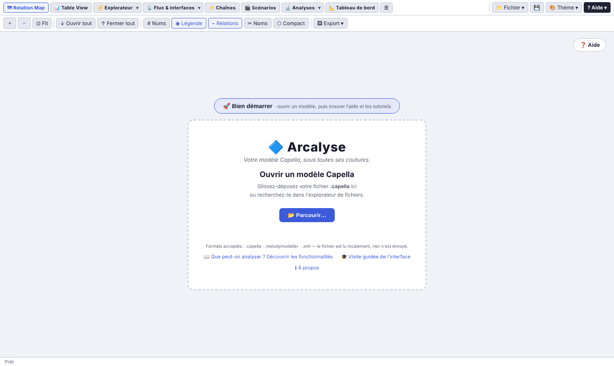
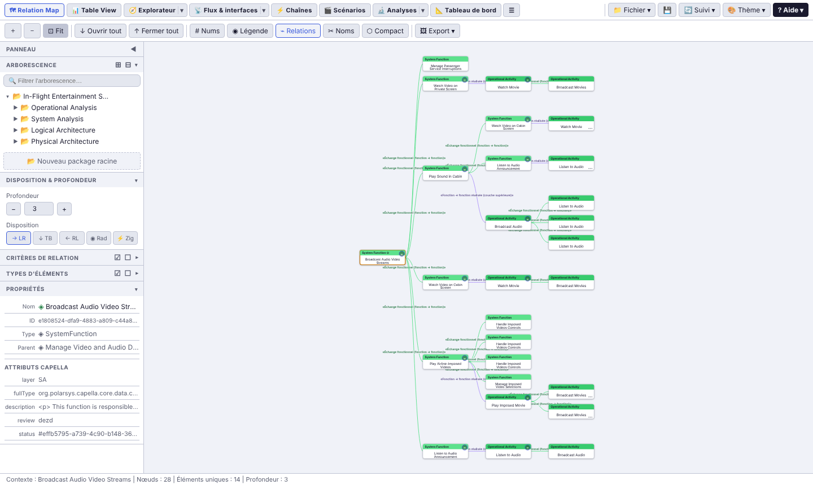
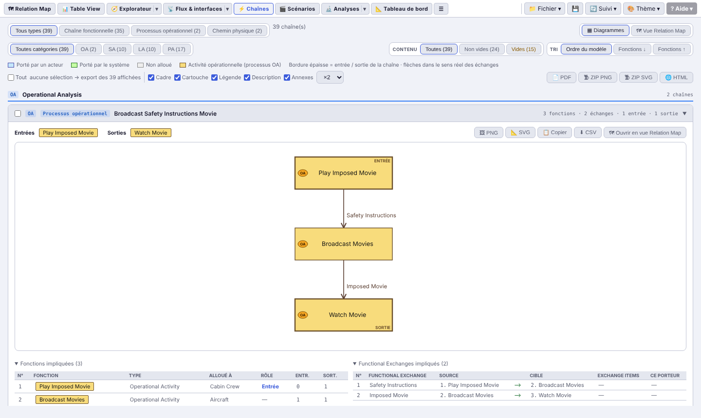
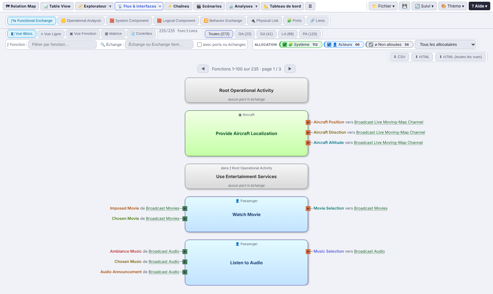
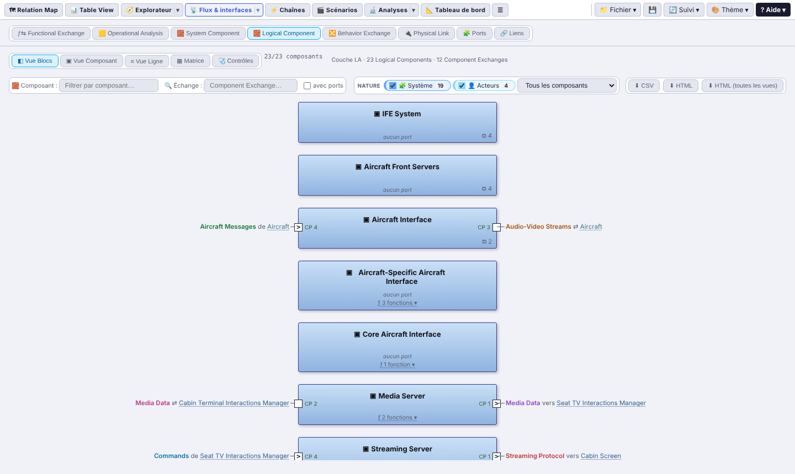
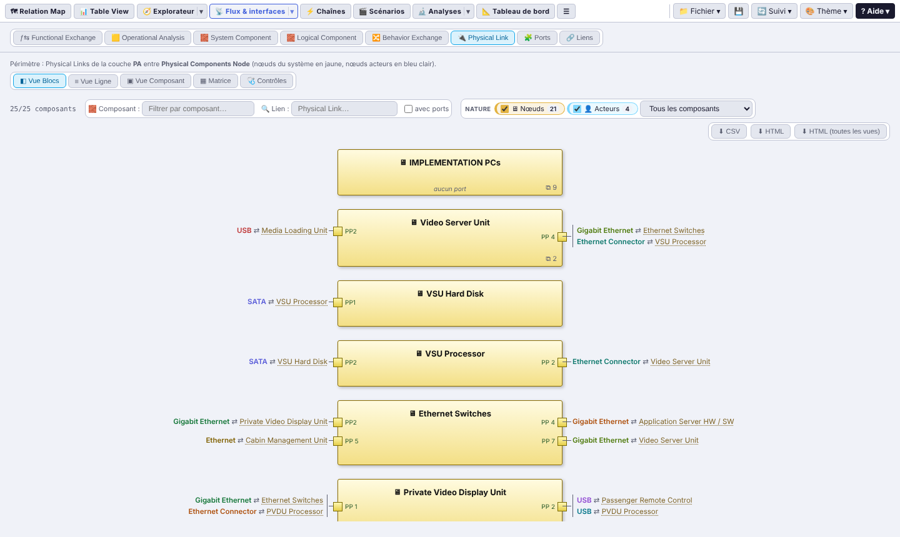
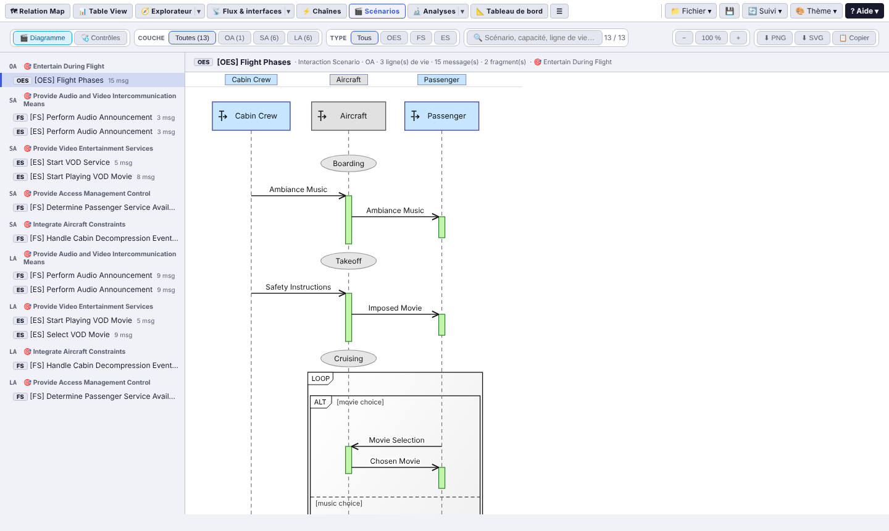
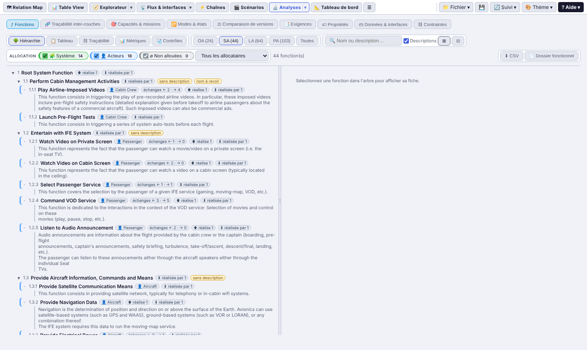
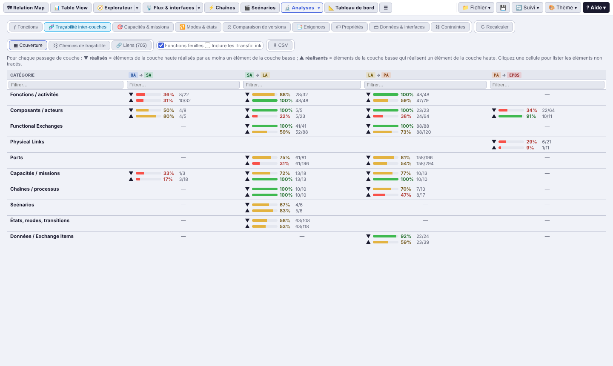
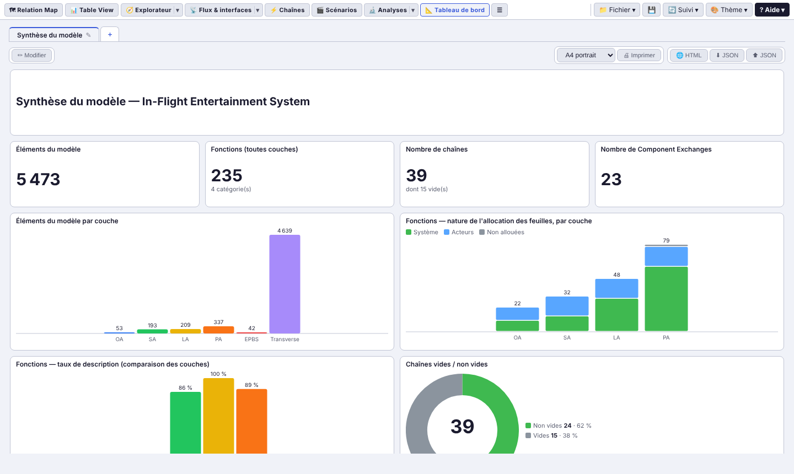

# 🔷 Arcalyse

### *Votre modèle Capella, sous toutes ses coutures.*

**Explorer, contrôler et comprendre un modèle Capella / ARCADIA — dans un seul fichier HTML, 100 % hors ligne.**

Aucune installation · aucun serveur · aucune donnée transmise · fonctionne sur un PC sécurisé sans réseau

---

## Pourquoi Arcalyse ?

Un modèle Capella grossit vite : des centaines de fonctions, d'échanges, de composants, de ports, réparties sur cinq couches. Dans l'atelier, chaque diagramme n'en montre qu'un morceau. **Arcalyse lit directement le fichier `.capella`** et vous donne, en quelques secondes, une vue d'ensemble, des vues façon Capella et des contrôles de cohérence — sans ouvrir Capella, sans rien installer.

- 📂 **Glissez-déposez** votre `.capella` : le modèle est analysé dans le navigateur, sur votre poste.
- 🔒 **Hors ligne absolu** : un seul fichier HTML autonome (bibliothèque D3 embarquée), aucune requête réseau. Idéal pour les environnements sensibles.
- 🧭 **Toutes les couches ARCADIA** : OA, SA, LA, PA, EPBS — fonctions, composants, échanges, chaînes, scénarios, exigences, propriétés.
- 🩺 **Des contrôles prêts à l'emploi** : éléments non alloués, ports non connectés, traçabilité incomplète, noms à revoir…
- 📤 **Exports partout** : CSV, PNG, SVG, PDF, rapports HTML autonomes, tableaux de bord imprimables en A4.
- 🔄 **Suivi du fichier** : Arcalyse détecte les nouvelles versions du `.capella` et montre ce qui a changé.

---

## Ce que vous pouvez faire

### 🗺 Naviguer dans les relations du modèle
Le graphe **Relation Map** centre la vue sur un élément et déplie ses voisins jusqu'à la profondeur voulue : décompositions, allocations, échanges, réalisations entre couches. Dispositions horizontale, verticale, radiale ; zoom, filtres par relation et par type ; export image.

### ⚡ Lire les chaînes fonctionnelles
Chaque chaîne fonctionnelle, processus opérationnel ou chemin physique est redessiné, avec ses entrées / sorties, les fonctions impliquées, leur allocation et les échanges. Filtres par type, couche et contenu ; export PDF, PNG, SVG, ZIP ou HTML de toutes les chaînes d'un coup.

### ƒ⇆ Voir les échanges comme dans Capella
Les **Vues Blocs** reprennent le rendu de Capella : fonctions vertes (système) ou bleues (acteurs), pins d'entrée et de sortie, échanges et fonction distante. Un clic sur la fonction distante vous y emmène. Même principe pour l'**Operational Analysis**, les **System / Logical Components**, le **Behavior Exchange** et les **Physical Links**, avec à chaque fois vue en lignes, matrice N² et contrôles.

### 🎬 Relire les scénarios
Les diagrammes de séquence (ES, FS, OES, OAS, IS) sont redessinés : lignes de vie, messages, exécutions, états et modes, fragments combinés (ALT, LOOP…), références. Contrôles et export PNG / SVG.

### 🔬 Analyser et contrôler
- **ƒ Fonctions** : hiérarchie avec descriptions, tableau façon Excel (filtres par valeur, copie), allocation au système ou aux acteurs, traçabilité entre couches, métriques, **qualité des noms** (verbes d'action en français et en anglais, règles personnalisables) et **dossier fonctionnel** imprimable.
- **🧬 Traçabilité inter-couches** : taux de réalisation OA → SA → LA → PA → EPBS par catégorie, en un coup d'œil, et la liste des éléments non tracés.
- **🎯 Capacités & missions**, **🔁 Modes & états**, **📑 Exigences**, **🏷 Propriétés**, **🗃 Données & interfaces**, **⛓ Contraintes**.
- **⚖ Comparaison de versions** : éléments ajoutés, supprimés, modifiés ou déplacés entre deux versions du modèle, avec rapport exportable.

### 📐 Composer vos tableaux de bord
Choisissez parmi des dizaines d'indicateurs (nombre d'éléments, allocation des fonctions, taux de description, chaînes vides, traçabilité…), disposez-les sur des pages A4, imprimez ou exportez en HTML.

### Et aussi
- 🧭 **Explorateur** : arborescence, cartes par couche, tableau paginé aux colonnes calculées, index des types ARCADIA.
- 🔗 **Liens** : toutes les relations du modèle, filtrables et exportables.
- 📊 **Table View** : tableaux construits à la demande en suivant les relations du modèle.
- 🎨 **Thèmes** : Sombre, Clair, Office 2007, contraste élevé, et votre thème personnalisé.
- 🎓 **Visite guidée** et aide intégrée, pour chaque vue.
- 💾 **Page HTML** : enregistrez l'application avec votre modèle, vos tableaux de bord et vos réglages, en un seul fichier à transmettre.

---

## Démarrer

1. **Récupérez le fichier HTML** :
   - version livrée, prête à l'emploi : **[`livraison/arcalyse-fr.html`](livraison/)** (bouton « Download raw file » sur GitHub) ;
   - ou version de développement, construite à partir des sources : `node build.js` produit **`dist/arcalyse-fr.html`**.
2. **Ouvrez-le** dans un navigateur récent (testé sous Google Chrome version 155), même sans réseau.
3. **Glissez-déposez** votre fichier `.capella` (ou cliquez sur 📂 Parcourir…). C'est tout.

> Pour essayer sans modèle à vous : les exemples publics [In-Flight Entertainment System](https://github.com/dbinfrago/Capella-IFE-sample) et [AIDA](https://sahara.irt-saintexupery.com/AIDA/AIDAArchitecture) sont dans `tests/models/`.

---

## Licence

Arcalyse est un logiciel libre, distribué sous **GNU General Public License version 3** — voir [`LICENSE`](LICENSE) et [`NOTICE.md`](NOTICE.md).
Copyright © 2026 Romain Lescole. Fourni sans aucune garantie.

Capella et ARCADIA sont des marques de leurs détenteurs respectifs (Eclipse Foundation, Thales). Arcalyse est un outil indépendant, compatible avec les modèles Capella : ni officiel, ni affilié.

D3.js v7.9.0 est embarqué sous licence ISC (© 2010-2023 Mike Bostock).
